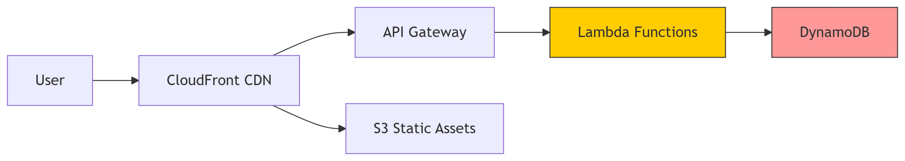

# Serverless Blog Platform

A CMS-free blog platform built with AWS serverless technologies and Terraform.

## Architecture

This project implements a serverless blog platform using the following AWS services:

- **API Gateway**: Handles API requests for blog operations
- **Lambda**: Processes backend logic for CRUD operations
- **DynamoDB**: Stores blog posts and metadata
- **S3**: Hosts static website files and blog assets
- **CloudFront**: Provides CDN caching and distribution



## Features

- Serverless architecture with auto-scaling
- CDN caching for improved performance
- Separation of content and presentation
- RESTful API for blog management
- Static website hosting for the frontend
- CI/CD pipeline with GitHub Actions

## Prerequisites

- AWS Account
- Terraform installed (v1.5.0+)
- AWS CLI configured with appropriate credentials
- GitHub account for CI/CD

## Local Development

1. Clone this repository
2. Navigate to the project directory
3. Initialize Terraform:
   ```
   terraform init
   ```
4. Review the deployment plan:
   ```
   terraform plan
   ```
5. Apply the configuration:
   ```
   terraform apply
   ```
6. Confirm the deployment by typing `yes` when prompted

## CI/CD Pipeline

This project includes GitHub Actions workflows for automated deployment:

1. **Terraform Deploy** (`terraform-deploy.yml`): Validates and deploys the infrastructure
   - Runs on pushes to main branch
   - Validates Terraform code on pull requests
   - Supports manual deployment to different environments

2. **Website Update** (`website-update.yml`): Updates website content without redeploying infrastructure
   - Runs when changes are made to website files
   - Uploads files to S3 and invalidates CloudFront cache

### Setting up GitHub Actions

To use the CI/CD pipeline, add the following secrets to your GitHub repository:

- `AWS_ACCESS_KEY_ID`: Your AWS access key
- `AWS_SECRET_ACCESS_KEY`: Your AWS secret key
- `TF_API_TOKEN`: (Optional) Terraform Cloud API token if using Terraform Cloud

## API Endpoints

- `GET /posts` - List all blog posts
- `POST /posts` - Create a new blog post
- `GET /posts/{slug}` - Get a specific blog post
- `PUT /posts/{slug}` - Update a blog post
- `DELETE /posts/{slug}` - Delete a blog post

## Blog Post Structure

A blog post in DynamoDB has the following structure:

```json
{
  "id": "unique-uuid",
  "slug": "post-url-slug",
  "title": "Post Title",
  "content": "Post content in HTML format",
  "excerpt": "Short summary of the post",
  "author": "Author Name",
  "createdAt": "2023-05-01T12:00:00Z",
  "updatedAt": "2023-05-01T12:00:00Z",
  "coverImage": "https://assets-bucket.s3.amazonaws.com/path/to/image.jpg",
  "tags": ["tag1", "tag2"],
  "status": "published"
}
```

## Lambda Functions

The project includes five Python Lambda functions:

1. **get-posts** - Retrieves all blog posts with pagination
2. **get-post** - Retrieves a single blog post by slug
3. **create-post** - Creates a new blog post
4. **update-post** - Updates an existing blog post
5. **delete-post** - Deletes a blog post

## Cleanup

To remove all resources created by this project:

```
terraform destroy
```

## Contributing

1. Fork the repository
2. Create a feature branch: `git checkout -b feature/my-feature`
3. Commit your changes: `git commit -am 'Add new feature'`
4. Push to the branch: `git push origin feature/my-feature`
5. Submit a pull request

## References

[1] Amazon Web Services, "Amazon API Gateway," AWS Documentation, 2023. [Online]. Available: https://docs.aws.amazon.com/apigateway/

[2] Amazon Web Services, "AWS Lambda," AWS Documentation, 2023. [Online]. Available: https://docs.aws.amazon.com/lambda/

[3] Amazon Web Services, "Amazon DynamoDB," AWS Documentation, 2023. [Online]. Available: https://docs.aws.amazon.com/dynamodb/

[4] Amazon Web Services, "Amazon S3," AWS Documentation, 2023. [Online]. Available: https://docs.aws.amazon.com/s3/

[5] Amazon Web Services, "Amazon CloudFront," AWS Documentation, 2023. [Online]. Available: https://docs.aws.amazon.com/cloudfront/

[6] HashiCorp, "Terraform Documentation," HashiCorp, 2023. [Online]. Available: https://www.terraform.io/docs

[7] GitHub, "GitHub Actions Documentation," GitHub Docs, 2023. [Online]. Available: https://docs.github.com/en/actions

[8] S. Roberts, "AWS Lambda: The Complete Guide to Serverless Microservices," O'Reilly Media, 2021.

[9] A. Wittig and M. Wittig, "Amazon Web Services in Action," Manning Publications, 3rd Edition, 2022.

[10] Y. Brikman, "Terraform: Up & Running," O'Reilly Media, 3rd Edition, 2022.

[11] D. Clinton, "Practical AWS: A Real-World Guide to Amazon's Cloud Services," Packt Publishing, 2021.

[12] M. Fowler, "Patterns of Enterprise Application Architecture," Addison-Wesley Professional, 2002.

## Author

Vincent Umeh
